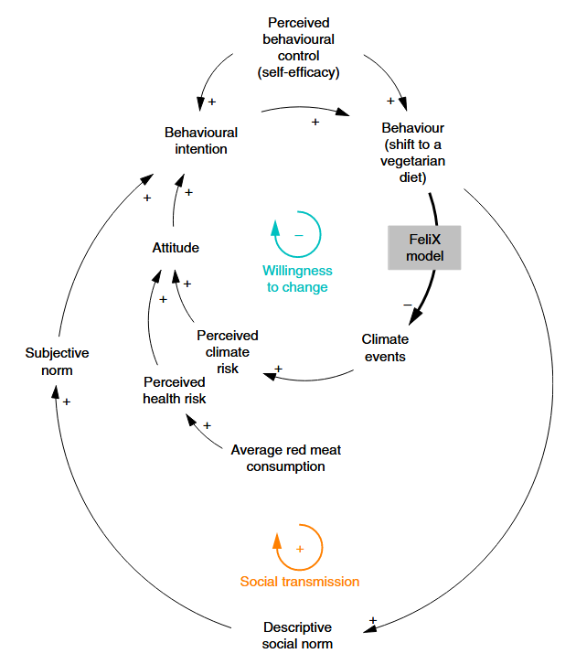

## Diet Change Population Dynamics Scenario

_Based on:_ Eker, S., Reese, G., Obersteiner, M. (2019). Modelling the drivers of a widespread shift to sustainable diets. _Nature Sustainability_, 2(8), 725-735. [https://doi.org/10.1038/s41893-019-0331-1](https://doi.org/10.1038/s41893-019-0331-1)

### Overview and Structure

This **Diet Change Population Dynamics Scenario** explores how population-level dietary behaviour evolves through social and psychological drivers, with implications for global consumption patterns and its environmental impacts.

Eker et al. (2019) adopt two main feedback mechanisms in the diet change module, grounded in two complementary psychological theories.

**Social transmission**, is based on the **Theory of Planned Behavior** ([Ajzen, 1991](<https://doi.org/10.1016/0749-5978(91)90020-T>)), which posits that behavioral intentions are shaped by perceived behavioral control (or self-efficacy), subjective social norms, and individual attitudes-i.e., whether a behavior is evaluated positively or negatively. In this context, diet change driven by social norms forms a **positive feedback loop**: as more individuals adopt a vegetarian diet, the social norm shifts, which in turn further encourages diet change.

**Willingness to change**, draws on the **Protection Motivation Theory** ([Boer & Seydel, 1996](https://psycnet.apa.org/record/1996-97268-004)), where behavior is determined by two types of appraisal: threat appraisal, the individual's evaluation of the severity of a threat, and coping appraisal, the perceived ability and willingness to manage the threat. In this context, the threat appraisal of climate change risk forms a negative feedback loop, where the diet shift to vegetarianism leads to lower emissions, fewer climate events and a lower threat.

### Scenario Inputs
The model incorporates several scenario inputs that represent the key factors influencing the feedbacks described above. The default value for each input is 100%, representing the reference effect, while the 0–200% range allows for weakening or strengthening the influence of each factor.

- **Self efficacy**: individuals’ confidence in their ability to adopt a more sustainable diet. In FeliXSim, the self efficacy lever affects both behavioural intention (to change) and actual behaviour.

- **Response efficacy**: belief that dietary change will lead to meaningful environmental or health benefits. In FeliXSim, the response efficacy lever influences behaviour only, not the intention to change.

- **Perceived risks**: awareness of the consequences of consumption for the climate. 
In FeliXSim, the perceived risks lever affects how responsive people are to extreme climate events, which in turn influences their intentions to change.

- **Social norms**: the influence of others’ dietary behaviours within a social group.
In FeliXSim, the social norm lever represents responsiveness to social pressure or normative expectations, which affects the intention to change diets.

Each of these input factors differ across population groups based on characteristics such as gender, education level, and age. This variation reflects how different segments of the population perceive their capability, expected benefits, risks, and social influences, which collectively shape patterns of dietary change.

---

### Findings

The findings show that **social norms** and **self-efficacy** are the most influential drivers of widespread dietary change. As more individuals adopt plant-based diets, a tipping point can be reached through social reinforcement, accelerating the transition. This underscores the importance of value-driven actions and group identity over purely risk-based motivations in shaping global dietary patterns and reducing the environmental impacts of the food system.
