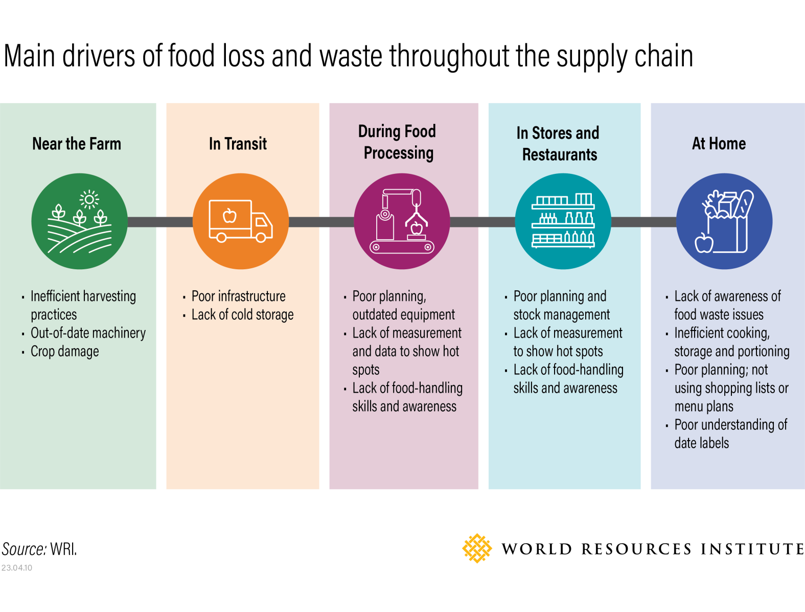

## Food Loss and Waste Scenario (by Supply Chain)

### Overview

Food loss and waste occur across the entire food supply chain - from initial production to final consumption. According to the Food and Agriculture Organization (FAO), **food loss** refers to the decrease in edible food mass that takes place during production, post-harvest, and processing stages - primarily due to infrastructural, logistical, or technical constraints. In contrast, **food waste** occurs at the retail and consumption stages and is often driven by behavioral or economic factors, such as over-purchasing, portion sizes, or the discarding of food that is still safe and edible ([FAO, 2014](http://www.fao.org/platform-food-loss-waste)).

### Supply Chain Stages

Earlier stages of the supply chain (e.g., primary production and post-harvest) are typically more prone to **food loss**, while the later stages - particularly **consumption** - are where **food waste** is most prevalent. Each stage presents both challenges and opportunities for reducing inefficiencies and improving the sustainability of food systems.

(1) **Primary Production.** This is the stage where crops are harvested or animals are raised for food. _Losses occur due to:_

- Pests, diseases, or extreme weather
- Harvesting inefficiencies (e.g., overripe or underripe crops left behind)
- Market or price fluctuations (e.g., food not harvested due to low market value)
- Cosmetic standards (produce rejected due to shape/appearance)

(2) **Post-Harvest Handling & Storage.** This is the stage where food is collected, sorted, cleaned, and stored before further processing or transport. _Losses occur due to:_

- Poor storage conditions (e.g., lack of refrigeration or pest protection)
- Inadequate infrastructure (e.g., damaged transport, lack of cooling)
- Delays that reduce freshness, especially for perishables

(3) **Processing & Packaging.** This is the stage where raw food is transformed into consumer-ready products (e.g., milling, canning, freezing). _Losses occur due to:_

- Trimming and processing waste (e.g., peels, bones, offcuts)
- Equipment inefficiencies or downtime
- Quality control rejections
- Overproduction or batch spoilage

(4) **Distribution & Retail.** This is the stage where food is transported to retailers and sold to consumers. _Losses occur due to:_

- Damage during transport (e.g., spoilage, packaging failure)
- Inadequate temperature control (cold chain issues)
- Overstocking and expired goods at retail
- Rejection of items that don't meet aesthetic or size standards

(5) **Consumption.** This is the stage where food is purchased, prepared, and eaten by consumers or served in food services. _Waste occurs due to:_

- Over-purchasing or improper storage at home
- Confusion over ""best before"" and ""use by"" labels
- Plate waste in households, restaurants, and cafeterias
- Cultural preferences and lack of awareness about waste "

---

### Formulation

To estimate food loss and waste across the supply chain, we utilize data from Cecilia et al. ([2019](https://link.springer.com/chapter/10.1007/978-3-030-10961-5_11])), which derives loss and waste proportions based on FAO statistics.

Food losses and waste occur at various stages of the supply chain and differ depending on the type of food. This formula calculates the final food waste and loss for each food category by adjusting for variations within supply chain segments and accounting for their respective contributions:

$$
\text{FWL}_{\text{food}} = \text{FWLVar}_{\text{supplychain}} \times \text{FWLShare}_{\text{supplychain, food}}
$$

**Where:**

- $\text{FWL}_{\text{food}}$: Final food waste and loss for a specific food category (food)
- $\text{FWLVar}_{\text{supplychain}}$: Variation factor in the supply chain segment (expressed as a multiplier, e.g., 1.1 for +10%)
- $\text{FWLShare}_{\text{supplychain, food}}$: Share (proportion) of the supply chain segment's contribution to the food waste and loss in the food category (between 0 and 1)

---

### Estimated Input Data for FeliX

| Stage              | PasMeat | CropMeat | Dairy   | Eggs    | Pulses  | Grains  | VegFruits | OtherCrops |
| ------------------ | ------- | -------- | ------- | ------- | ------- | ------- | --------- | ---------- |
| Primary Production | 3.1     | 3        | 7.1     | 7.1     | 1.9     | 14.5    | 9         | 1.9        |
| Post-Harvest       | 6       | 7        | 4.7     | 4.7     | 1.9     | 2.1     | 6         | 1.9        |
| Processing         | 4.7     | 5        | 1.2     | 1.2     | 4.8     | 4.1     | 9         | 4.6        |
| Distribution       | 1.1     | 1        | 2.3     | 2.3     | 3.8     | 5.2     | 7         | 4.2        |
| Consumption        | 5.1     | 4        | 4.7     | 4.7     | 7.6     | 4.1     | 14        | 7.4        |
| **Total**          | **20%** | **20%**  | **20%** | **20%** | **20%** | **30%** | **45%**   | **20%**    |

 

\*_Source_: Cecilia et al. ([2019](https://link.springer.com/chapter/10.1007/978-3-030-10961-5_11])) based on FAO Data.
